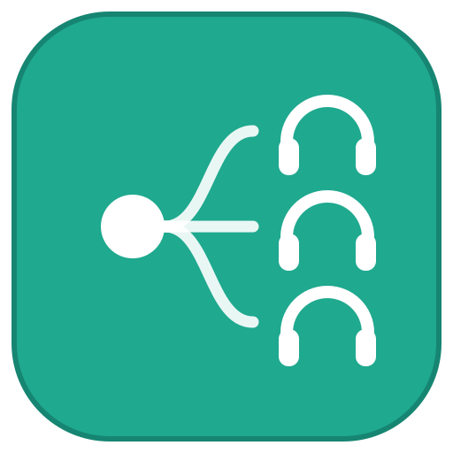

<p align="center">
  
</p>
<h1 align="center">Virtual sound field</h1>

<p align="center">
  <strong>将音频同时播放到多个音箱</strong><br>
  <strong>Virtual sound field</strong> 将电脑正在播放的内容镜像到任意数量的音频设备。
</p>

<p align="center">
  <em>基于 <a href="https://github.com/Kimsec/EarShare">Kimsec/EarShare</a> 的升级版本</em>
</p>

## 相比原版的改进

- **完整简体中文界面** — 所有UI文本已汉化
- **系统音量控制** — 顶部集成系统音量滑块，实时同步Windows音量
- **总音量调节** — 一键加减所有设备音量（+/- 2%）
- **静音恢复完美同步** — 静音后恢复播放时自动重建管线，确保音频同步
- **可配置丢弃阈值** — 新增 Skip 参数，自定义缓冲区溢出时的丢弃策略
- **优化的缓冲管理** — 初始缓冲 = 延迟 + 丢弃/2，给漂移校正器更多空间

## 虚拟声道/声场

Virtual sound field 支持多种虚拟声道模式，让您可以使用多个音箱组建自定义的虚拟声场：

### 支持的声道模式

| 模式 | 通道数 | 通道名称 | 用途 |
|------|--------|----------|------|
| **左右分离** | 2 | 左声道、右声道 | 基础立体声分离，分配左右声道音箱 |
| **前后立体声** | 2 | 前置立体声、后置立体声 | 分离前后声场，适配立体声音箱组，组成360°环绕声场，更沉浸 |
| **四角环绕** | 4 | 前左(FL)、前右(FR)、后左(RL)、后右(RR) | 4声道环绕声场，适合游戏/电影 |
| **5.1声道** | 6 | 前左(FL)、前右(FR)、中置(C)、低音(LFE)、环绕左(SL)、环绕右(SR) | 完整5.1环绕声，专业影音体验 |

### 使用场景

- **游戏体验**：使用四角环绕模式，将4个音箱分别放置在前后左右，获得360度游戏音效
- **家庭影院**：使用5.1声道模式，用多个音箱组建个人影院系统
- **音乐分享**：使用左右分离模式，与朋友一起分享立体声音乐
- **沉浸式体验**：使用前后立体声模式，获得更强的空间感

### 声场布局示意图

```
        前方
    ┌─────────┐
    │ FL   FR │    四角环绕/5.1声道
    │         │
    │   C     │    (中置 - 仅5.1)
    │         │
    │ SL   SR │    环绕声道 - 仅5.1
    │         │
    │ RL   RR │    后置声道
    └─────────┘
        后方
```

## 支持的音频接口

Virtual sound field 支持多种音频接口，可以自由组合不同类型的音箱：

| 接口类型 | 说明 | 适用场景 |
|----------|------|----------|
| **蓝牙** | 无线连接，支持蓝牙音箱/耳机 | 便携、多设备组网 |
| **USB** | 有线连接，USB声卡/USB音箱 | 低延迟、稳定连接 |
| **HDMI** | 高清数字接口 | 家庭影院、电视音箱 |
| **DP (DisplayPort)** | 高清数字接口 | 显示器内置音箱、专业音频设备 |

> [!TIP]
> 可以混合使用不同接口的音箱，例如：2个蓝牙音箱 + 2个USB音箱 + HDMI音箱，组建自定义声场。

## 功能特性

- **轻量级** — 一个小型托盘应用，几乎不占用CPU
- **无需安装** — 单个便携式 `.exe`
- **支持任意数量设备** — 蓝牙、USB、HDMI、DP...自由混合
- **保持同步** — 自动时钟漂移校正，让每个音箱保持对齐
- **低延迟** — 可调节缓冲区，最低20ms
- **每设备双滑块音量** — 软件音量 + 输出电平独立控制
- **系统音量同步** — 实时显示和控制系统主音量
- **简单易用** — 选择源设备，添加输出设备，点击开始

## 快速开始

1. 下载 `VirtualSoundField.exe` — 无需安装
2. 运行程序（Windows SmartScreen 可能会警告：*更多信息 → 仍然运行*）
3. 在 **镜像来源** 中选择要镜像的音频源 — 或保持 *系统默认*
4. **添加设备** → 选择每个音箱，设置音量
5. 点击 **开始** 享受

> [!IMPORTANT]
> 关闭窗口会将 Virtual sound field 发送到系统托盘，音频继续播放 — 右键点击托盘图标可停止或退出。
> 设备和音量设置会被记住，下次启动时自动恢复。

需要 Windows 10/11 (64位)。

## 使用提示

- 源设备正常播放；镜像设备会有 50-60ms 延迟 + 蓝牙自身的延迟。
- 某个音箱落后于其他？调高快速设备的 **延迟(ms)** 值使其对齐。
- 音频落后于视频？在播放器中调整音频偏移（VLC: `j`/`k`）。
- 听到爆音或断流？调高 **缓冲(ms)** 值。
- 向3个以上蓝牙音箱串流可能会耗尽单个蓝牙适配器的带宽。

### 音量控制说明

| 控件 | 说明 |
|------|------|
| 系统音量滑块 | 控制Windows系统主音量，实时同步 |
| 🔊 按钮 | 系统静音/取消静音 |
| 总音量 +/- | 同时调整系统音量和所有设备音量 |
| 软件音量滑块 | 控制该设备在Virtual sound field内的音量 |
| 输出电平滑块 | 控制该设备的输出电平 |

### 参数说明

| 参数 | 范围 | 默认 | 说明 |
|------|------|------|------|
| 缓冲 (Buffer) | 20-500 ms | 40 | 每个设备播放前的音频队列长度 |
| 丢弃 (Skip) | 10-500 ms | 70 | 当缓冲区超出目标这么多时丢弃音频 |

## 从源码构建

需要 [.NET 8 SDK](https://dotnet.microsoft.com/download/dotnet/8.0)。

```powershell
git clone https://github.com/your-username/Virtual-sound-field.git
cd Virtual-sound-field
dotnet run
```

生成独立单文件 exe：

```powershell
dotnet publish -c Release -r win-x64 --self-contained true `
  -p:PublishSingleFile=true `
  -p:IncludeAllContentForSelfExtract=true `
  -p:EnableCompressionInSingleFile=true
```

基于 [NAudio](https://github.com/naudio/NAudio) 构建（WASAPI loopback 捕获，
每个设备独立缓冲和漂移校正的输出管线）。

## 致谢

感谢 [Kimsec](https://github.com/Kimsec) 创建的原版 EarShare。

## License

[MIT](LICENSE)

基于 [Kimsec/EarShare](https://github.com/Kimsec/EarShare) 项目，在 MIT 许可证下修改和分发。